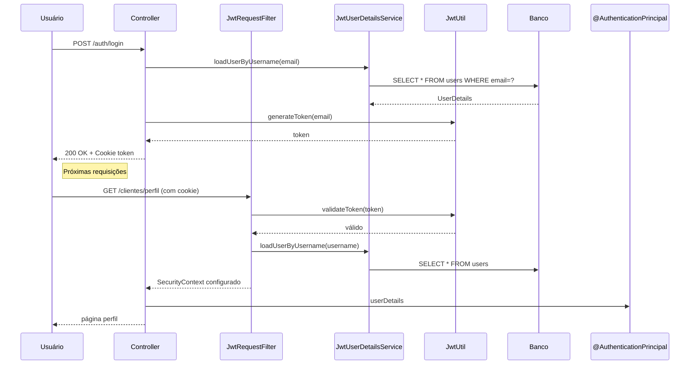

# 📂 Documentação de Segurança

## Visão Geral

Este documento explica os mecanismos de segurança implementados no projeto,
incluindo autenticação, autorização, JWT e configuração de segurança.

---

## 1. Arquitetura de Segurança

### Componentes Principais

| Componente                      | Descrição                                   |
| ------------------------------- | ------------------------------------------- |
| **JwtUtil**                     | Geração e validação de tokens JWT           |
| **JwtRequestFilter**            | Filtro que processa requisições com JWT     |
| **JwtUserDetailsService**       | Carrega usuários do banco para autenticação |
| **JwtAuthenticationEntryPoint** | Manipula erros de autenticação              |
| **SecurityConfig**              | Configuração global de segurança            |

---

## 2. JWT (JSON Web Token)

### O que é JWT?

JWT é um padrão para criação de tokens de acesso que permitem transmitir
informações entre partes de forma segura e compacta.

### Estrutura do Token

```
xxxxx.yyyyy.zzzzz
  │      │     └── Signature (Assinatura)
  │      └──────── Payload (Dados)
  └─────────────── Header (Cabeçalho)
```

### Implementação no Projeto

#### JwtUtil

**Localização**: `src/main/java/umc/exs/security/JwtUtil.java`

**Funcionalidades**:

| Método                                        | Descrição                            |
| --------------------------------------------- | ------------------------------------ |
| `generateToken(String subject)`               | Gera um novo token JWT               |
| `extractUsername(String token)`               | Extrai o username (email) do token   |
| `validateToken(String token)`                 | Valida a assinatura e expiração      |
| `addTokenCookie(HttpServletResponse, String)` | Adiciona token como cookie HTTP-only |
| `clearJwtCookie(HttpServletResponse)`         | Remove o cookie de token             |

**Configurações**:

```java
@Value("${jwt.secret:changeitchangeitchangeitchangeit}")
private String secret;

@Value("${jwt.expiration:86400000}") // 24 horas em milissegundos
private long expirationMs;

@Value("${jwt.cookie.name:token}")
private String cookieName;
```

**Exemplo de Geração de Token**:

```java
public String generateToken(String subject) {
    Date now = new Date();
    Date exp = new Date(now.getTime() + expirationMs);

    return Jwts.builder()
            .subject(subject)  // Email do usuário
            .issuedAt(now)
            .expiration(exp)
            .signWith(getSigningKey())  // Chave HMAC-SHA
            .compact();
}
```

---

## 3. Filtro de Requisição JWT

### JwtRequestFilter

**Localização**: `src/main/java/umc/exs/security/JwtRequestFilter.java`

**O que faz**: Intercepta todas as requisições HTTP e verifica a presença de um
token JWT válido.

**Fluxo de Processamento**:

```
1. Requisição HTTP recebida
        ↓
2. Extrai token (Cookie ou Header Authorization)
        ↓
3. Token existe? Não → Continua sem autenticação
        ↓
   Sim
        ↓
4. Token válido? Não → Continua sem autenticação
        ↓
   Sim
        ↓
5. Extrai username do token
        ↓
6. Carrega UserDetails do banco
        ↓
7. Configura autenticação no Spring Security Context
        ↓
8. Continua para o Controller
```

**Extração de Token**:

```java
private String resolveTokenFromRequest(HttpServletRequest request) {
    // 1. Tenta buscar nos Cookies
    Cookie[] cookies = request.getCookies();
    if (cookies != null) {
        for (Cookie cookie : cookies) {
            if ("token".equalsIgnoreCase(cookie.getName())) {
                return cookie.getValue();
            }
        }
    }

    // 2. Tenta buscar no Header Authorization
    String authHeader = request.getHeader("Authorization");
    if (authHeader != null && authHeader.startsWith("Bearer ")) {
        return authHeader.substring(7);
    }

    return null;
}
```

---

## 4. UserDetailsService

### JwtUserDetailsService

**Localização**: `src/main/java/umc/exs/security/JwtUserDetailsService.java`

**O que faz**: Carrega os dados do usuário do banco de dados para o Spring
Security.

**Responsabilidades**:

1. Buscar usuário por email
2. Converter para formato do Spring Security (`UserDetails`)
3. Fornecer authorities (papéis/permissões)

---

## 5. Configuração de Segurança

### SecurityConfig

**Localização**: `src/main/java/umc/exs/config/SecurityConfig.java`

**Configurações Principais**:

#### CORS (Cross-Origin Resource Sharing)

```java
@Bean
public CorsConfigurationSource corsConfigurationSource() {
    CorsConfiguration cfg = new CorsConfiguration();
    cfg.setAllowedOrigins(List.of(allowedOrigin)); // Origin permitida
    cfg.setAllowedMethods(List.of("GET", "POST", "PUT", "DELETE", "OPTIONS"));
    cfg.setAllowedHeaders(List.of("*"));
    cfg.setAllowCredentials(true); // Permite credenciais
    cfg.setMaxAge(3600L);
    // ...
}
```

#### CSRF (Cross-Site Request Forgery)

```java
.csrf(csrf -> csrf.disable())  // Desabilitado para APIs REST
```

#### Sessão

```java
.sessionManagement(sm -> sm.sessionCreationPolicy(SessionCreationPolicy.STATELESS))
// STATELESS = Sem estado (cada requisição é independente)
```

#### Autorização de Rotas

```java
.authorizeHttpRequests(auth -> auth
    // Rotas públicas
    .requestMatchers("/", "/index", "/home").permitAll()
    .requestMatchers("/clientes/login", "/clientes/novo-cadastro").permitAll()
    .requestMatchers("/vender", "/vitrine").permitAll()
    .requestMatchers("/auth/**", "/debug").permitAll()
    
    // Rotas de admin
    .requestMatchers("/admin/**").hasAuthority("ADMIN")
    .requestMatchers("/api/admin/**").hasAuthority("ADMIN")
    
    // Rotas autenticadas
    .requestMatchers("/clientes/meu-perfil").authenticated()
    .requestMatchers("/api/tokens/comprar").authenticated()
    
    // Qualquer outra rota
    .anyRequest().authenticated()
)
```

#### Filtro JWT

```java
http.addFilterBefore(jwtRequestFilter, UsernamePasswordAuthenticationFilter.class);
// Adiciona o filtro ANTES do filtro padrão de autenticação
```

---

## 6. Criptografia de Senhas

### BCrypt

O projeto utiliza **BCrypt** para criptografia de senhas.

**Características**:

- Senha "salgada" automaticamente (salt)
- Resistência a ataques de força bruta
- Função de hash segura

**Configuração**:

```java
@Bean
public PasswordEncoder passwordEncoder() {
    return new BCryptPasswordEncoder();
}
```

**Uso**:

```java
// Criptografar senha
String senhaCriptografada = passwordEncoder.encode(senha);

// Verificar senha
boolean matches = passwordEncoder.matches(senhaDigitada, senhaCriptografada);
```

---

## 7. Autenticação vs Autorização

### Autenticação (Authentication)

**O que é**: Verificar a identidade do usuário (quem você é).

**No projeto**:

- Validação de credenciais (email + senha)
- Geração de token JWT
- Login via `AuthController` e `ClientController`

### Autorização (Authorization)

**O que é**: Verificar o que o usuário pode fazer (permissões).

**No projeto**:

- `hasAuthority("ADMIN")` - Rotas restritas a administradores
- Roles definidas no `UserDetails`
- Configuração em `SecurityConfig`

---

## 8. Fluxo de Autenticação

### Login Bem-sucedido

```
1. Usuário envía POST /auth/login com {email, senha}
        ↓
2. AuthController recebe requisição
        ↓
3. JwtUserDetailsService carrega usuário por email
        ↓
4. PasswordEncoder verifica a senha
        ↓
5. Se válido: JwtUtil.generateToken(email)
        ↓
6. Cookie HTTP-only criado com o token
        ↓
7. Retorna 200 OK com token
        ↓
8. Cliente envía token em todas as requisições subsequentes
```

### Requisição Autenticada

```
1. Requisição com Cookie "token"
        ↓
2. JwtRequestFilter intercepta
        ↓
3. Extrai e valida token
        ↓
4. Extrai email do token
        ↓
5. Carrega UserDetails
        ↓
6. Configura Authentication no SecurityContext
        ↓
7. @AuthenticationPrincipal injeta o usuário no Controller
        ↓
8. Controller processa a requisição
```

---

## 9. Auditoria de Segurança

### O que é registrado

O projeto mantém logs de auditoria para operações sensíveis:

| Ação                 | Descrição                  |
| -------------------- | -------------------------- |
| LOGIN_SUCESSO        | Login bem-sucedido         |
| LOGIN_FALHA          | Credenciais inválidas      |
| LOGOUT_SUCESSO       | Logout                     |
| CADASTRO_SUCESSO     | Novo cadastro              |
| SENHA_RECU_INICIO    | Início de recuperação      |
| LIVRO_APROVADO       | Livro aprovado pelo admin  |
| LIVRO_REJEITADO      | Livro rejeitado pelo admin |
| COMPRA_LIVRO_SUCESSO | Compra realizada           |

**LogAuditoriaService**:

```java
public void registrarLog(String acao, Long idUsuario, String emailUsuario, String detalhes) {
    LogAuditoria la = new LogAuditoria(idUsuario, emailUsuario, acao, detalhes, LocalDateTime.now());
    repository.save(la);
}
```

---

## 10. Recuperação de Senha

### Fluxo

```
1. GET /clientes/recuperar-senha (página)
        ↓
2. POST /clientes/recuperar-senha (email)
        ↓
3. ClienteService.iniciarRecuperacaoSenha(email)
   - Gera token único (UUID)
   - Salva no banco com validade (30 minutos)
   - Envia email com link
        ↓
4. GET /clientes/reset-senha?token=xxx
        ↓
5. POST /clientes/alterar-senha
        ↓
6. ClienteService.alterarSenhaComToken(token, novaSenha)
   - Valida token
   - Criptografa nova senha
   - Salva no banco
   - Remove token
```

---

## 11. Boas Práticas Implementadas

### ✅ Implementado

| Prática                   | Descrição                  |
| ------------------------- | -------------------------- |
| Senhas criptografadas     | BCrypt com salt            |
| Token em cookie HTTP-only | Previne XSS                |
| Sessões Stateless         | JWT sem estado             |
| CSRF Desabilitado         | APIs REST (seguro com JWT) |
| CORS configurado          | Apenas origem permitida    |
| Validação de entrada      | Bean Validation            |
| Auditoria de ações        | LogAuditoriaService        |
| Recuperação de senha      | Token com expiração        |
| Tentativas de login       | Bloqueio após 5 falhas     |

### ⚠️ Recomendações Futuras

| Prática             | Descrição                    |
| ------------------- | ---------------------------- |
| HTTPS em produção   | Cookie secure = true         |
| Rate limiting       | Limitar tentativas de login  |
| 2FA                 | Autenticação de dois fatores |
| Refresh tokens      | Renovação de token           |
| Auditoria detalhada | Log de IP, User-Agent        |

---

## 12. Fluxo Autenticação (Mermaid)


